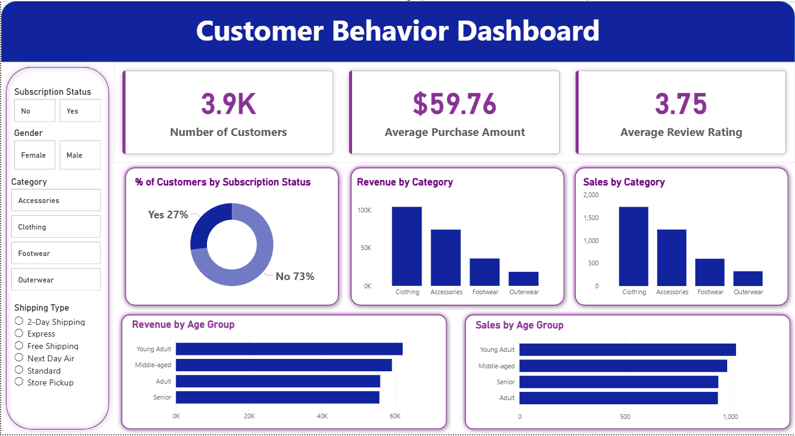

# End-to-End Customer Behavior Analysis

### Power BI | Python | SQL

<p align="center">
  
</p>

---

## 📌 Project Overview

This project demonstrates a **complete end-to-end data analytics workflow**, designed to closely mirror the real-world responsibilities of a professional Data Analyst. It covers the entire analytics lifecycle, starting from raw data cleaning and preprocessing to SQL-based business analysis and interactive dashboard creation using Power BI.

The primary goal of the project is to analyze **customer behavior patterns**, identify key business insights, and present them in a clear, decision-oriented format.

---

## 🎯 Business Objectives

* Analyze customer purchasing behavior and preferences
* Understand subscription adoption and its impact on revenue
* Identify high-performing product categories and customer segments
* Support data-driven decision-making through interactive dashboards

---

## 🗂 Dataset Description

The dataset contains customer shopping behavior data with attributes related to:

* Customer demographics (Age Group, Gender)
* Subscription status
* Product categories
* Shipping types
* Purchase amount and sales volume
* Customer review ratings

All raw data is preserved and transformations are documented to ensure data integrity.

---

## ⚙️ Tools & Technologies Used

| Tool                       | Purpose                                   |
| -------------------------- | ----------------------------------------- |
| **Python (Pandas, NumPy)** | Data cleaning and preprocessing           |
| **SQL**                    | Business querying and analytical analysis |
| **Power BI**               | Data modeling and interactive dashboards  |
| **Git & GitHub**           | Version control and project hosting       |

---

## 🏗 Project Structure

```
end-to-end-customer-behavior-analysis-powerbi-python-sql/
│
├── data/
│   ├── raw/                # Original dataset
│   └── processed/          # Cleaned dataset
│
├── notebooks/
│   └── customer_behavior_data_cleaning.ipynb
│
├── sql/
│   └── customer_behavior_analysis.sql
│
├── powerbi/
│   └── customer_behavior_dashboard.pbix
│
├── visuals/
│   └── customer_behavior_dashboard.png
│
├── reports/
│   └── insights_summary.md
│
├── README.md
└── requirements.txt
```

This structure follows **industry best practices** for analytics projects.

---

## 🔄 End-to-End Workflow

1. **Data Collection**

   * Imported raw customer data in CSV format

2. **Data Cleaning (Python)**

   * Handled missing values
   * Standardized categorical fields
   * Verified data types
   * Exported clean dataset for analysis

3. **Data Analysis (SQL)**

   * KPI calculations
   * Category-wise revenue analysis
   * Subscription behavior analysis
   * Demographic-based insights

4. **Data Visualization (Power BI)**

   * Built interactive dashboard
   * Implemented filters for dynamic exploration
   * Created KPI cards and comparative charts

5. **Insight Reporting**

   * Documented business findings and recommendations

---

## 📊 Key Insights Summary

* **Clothing** is the top-performing category in both sales and revenue
* Only **27% of customers are subscribed**, indicating growth potential
* **Young Adults and Middle-aged** customers contribute the highest revenue
* Average customer rating suggests **moderate satisfaction**, with scope for improvement

Detailed insights are available in the [`reports/insights_summary.md`](reports/insights_summary.md) file.

---

## 📈 Power BI Dashboard Highlights

* Total customers overview
* Average purchase and rating KPIs
* Subscription vs non-subscription distribution
* Revenue and sales by category
* Demographic performance analysis

The dashboard is fully interactive with slicers for:

* Gender
* Subscription status
* Category
* Shipping type

---

## 🚀 Business Recommendations

* Improve subscription adoption through targeted offers
* Focus marketing efforts on high-revenue age groups
* Optimize underperforming product categories
* Enhance customer experience to improve satisfaction ratings

---

## 👤 Author

**Soumyadeep Kundu**
Aspiring Data Analyst
Skilled in Python, SQL, Power BI, and end-to-end data analytics workflows
